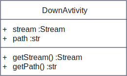

# Proyecto PyDownVideo (Versión 0.5.4)

<div style="display: flex; justify-content: center; gap:100px;">
    
</div>


## Qué es PyDownVideo ??

Este proyecto trata sobre la creación de un programa escrito en Python con el propósito de facilitar la tarea de descargar videos de Youtube de una manera: sencilla, gratis y eficiente.

## Librerías utililzadas para su desarrollo:

- Flet (Para el llamativo diseño)
- Pytube (Para hacer posible descargar los videos de Youtube)


# Diseño de la Clase DownActivity



Este clase posee dos atributos principales:
===========================================

- yt se encarga de obtener y crear un objeto YouTube a partir de este y poder obtener el title y thumbnail de el video correspondiente a descargar
- Posee un metodo llamado ShowActivity que retorna un ft.Card() donde muestra el titulo y miniatura de el video a descargar

# Componentes Importantes

## textfield_URL
Este componente nos servira para colocar la URL del video que necesitemos descargar

## SearchButton
Este ft.IconButton al presionarlo verificará que esta URL es válida, después nos mostrará una instancia de DownActivity.ShowActivity() y ejecutará la función OptionsDown() encargada de listar las posibles formas de descarga que pueda desear.

## label_progress & progress
Ambos componentes necesarios para mostrar el porcentaje de descarga que presenta el archivo

# Funciones Importantes 

## on_progress
Función usada de callback para:
```python
yt = YouTube(textfield_URL.value, on_progress_callback=on_progress)
```
Donde cada vez que se descargue un trozo del archivo se ejecutara esta porción de código:
```python
    def on_progress(stream: Stream, chunk, bytes_remaining):
        total_size = stream.filesize
        bytes_down = total_size - bytes_remaining
        porcent = bytes_down / total_size * 100

        label_progress.value = f"{round(porcent,2)}%"
        progress.value = round(porcent,2) / 100

        if(round(porcent,2) == 100):
            label_progress.value = "0%"
            progress.value = 0
            listActivity.controls = []
            estado.value = "Archivo Descargado"
            estado.color = ft.colors.GREEN

            textfield_URL.disabled = False
            SearchButton.disabled = False

        page.update()
```
Al ejecutarse actualiza el porcentaje a mostar por progress y label_progress. En caso de que estos llegen a 100% "resetea" a ambos componentes a 0% y elimina la instancia de DownActivity.ShowActivity() en el page.
Antes de cerrar esta función para actualizar los cambios en la vista llamamos a page.update()

<p style="color: red; font-weight: bold">Note que los parámetros stream, chunk, bytes_remaining son agregados al adjuntarlo en la creacion del objeto yt a descargar en la función Download()</p>


## OptionsDown
Esta función por parámetros obtendrá la lista de streams de el objeto yt creado en Validacion.

Primeramente agrega al componente listDownActivities un ft.Container para encabezar una tabla:
```python
listDownActivities.controls.append(
            ft.Container(
                content=ft.Row(
                    controls=[
                        ft.Text("Tipo", size=20),
                        ft.Text("Calidad", size=20),
                        ft.Text("FPS/Codec", size=20),
                        ft.Text("Formato", size=20),
                        ft.Text("Peso MB", size=20),
                        ft.Text("Descargar", size=20)
                    ],
                    alignment=ft.MainAxisAlignment.SPACE_EVENLY,
                ),
                padding=15,
                bgcolor=ft.colors.GREY_800
            )
        )
```

Después muestra un ft.Container por cada stream detectado, mostrando de el los datos importantes, este muestra unos datos para el caso de Video pero si es Audio mostrará otras especificaciones:

Este es en el caso de que sea el stream iterado de tipo Video
```python
if(sr.type == "video"):
    listDownActivities.controls.append(
        ft.Container(
            content=ft.Row(
                controls=[
                    ft.Text("Video"),
                    ft.Text(sr.resolution),
                    ft.Text(sr.fps),
                    ft.Text(sr.mime_type),
                    ft.Text(value=f"{sr.filesize_mb} MB"),
                    ft.IconButton(icon=ft.icons.DOWNLOAD,icon_color="blue600",tooltip="Download", on_click=lambda e: Download(sr.itag))
                ],
                alignment=ft.MainAxisAlignment.SPACE_EVENLY
            ),
            padding=15
        )
    )
```


## Download
Esta función se encargará de descargar el archivo pertinente con el ID que le pasaremos por los atributos, diferenciando así que archivo descargar en toda la lista de streams de yt. 

Además de leer a el componente textfield_PATH_FILE el cual guarda la ruta en donde se va a descargar el archivo. De caso que este sea invalido se activará el try/except que está colocado allí y mostrardo el error en el mismo textfield_PATH_FILE