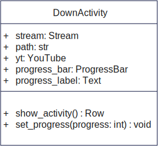
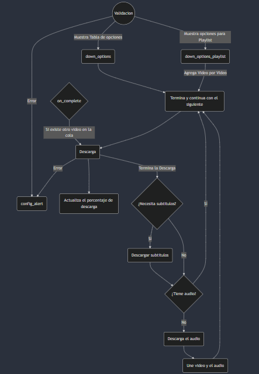

# Proyecto PyDownVideo (Versión 0.7.13)

<div style="display: flex; justify-content: center; gap:100px;">
    
</div>


## Qué es PyDownVideo ??
Este proyecto trata sobre la creación de un programa escrito en Python con el propósito de facilitar la tarea de descargar videos de Youtube de una manera: sencilla, gratis y eficiente.

## Librerías utililzadas para su desarrollo:
- Flet (Para el llamativo diseño)
- Pytubefix (Para hacer posible descargar los videos de Youtube)
- MoviePy (Para realizar conversiones y unir videos no progresivos de pytubefix)

# Diseño de la Clase DownActivity



## Atributos
- **stream** se encarga de almacenar el stream que se va a descargar.
- **path** guardará la ruta donde se descargará el video.
- **yt** es el video en específico a dercargar.
- **progress_bar** es un componente de Flet que muestra el porcentaje de descarga
- **progress_label** es un componente de Flet el cual muestra el valor del porcentaje de descarga 

## Métodos
- **show_activity()** Este cargará el componente que se mostrará en pantalla para poder hacer visible: el nombre del mismo, porcentaje de dascarga y su valor. Este se retornará en un componente Row de Flet
- **set_progress(progress: int)** Este actualizará los valores de porcentaje que muestran progress_bar y progress_label.

# Componentes
- **theme_icon**: se encargará de ejecutar la función **change_theme** el cual cambia el tema de claro o oscuro y al revés.
- **progress_ring**: componente que se mostrará en determinados casos para mostrar la espera de una respuesta.
- **list_down_options**: componente que carga la tabla de opciones de descarga.
- **list_activity**: compoenete donde se mostrarán visualmente que video se esta descargando.
- **config_alert**: componente utilizado para mostrar errores por medio de una alerta.
- **textfield_path_file**: componente para guardar la ruta de descarga.
- **estado**: componente que muestra si se está descargando un video o no.
- **search_button**: botón que ejecuta la funcion de validación.
- **textfield_url**: componente en donde agregaremos la URL del video a descargar.
- **cancel_download_button**: botón que se encarga de cancelar la selección del video que se descargará

# Funciones Importantes 

### validation
Esta función se encargará de validar la URL insartada en **textfield_url**, además de verificar si es una Playlist o un video solamente.

### down_options
En caso de que en la función de validacion() determine que es un video, entonces esta función mostrará una tabla con las posibles formas de descarga.

### down_options_playlist
En caso de que en la función de validacion() determine que es una playlist, entonces al igual que la otra, mostrará otra tabla pero más reducida, la configuración de descarga seleccionada se aplicará para todos los videos descargados a partir de la playlist. 

### admin_list_activities
Esta función se encarga de administrar la cola de descargas del programa de forma general, capáz de adaptarse a casos específicos.

- De caso que **next_progress** es False entrará a agregar el video especificado a la cola de descargas y mostrará en pantalla dicho componente, de caso que en la cola solo este ese video empezará a descargarse automaticamente.
- Si **next_progess** es True entonces irá directamente a verificar si hay otro video en la cola para descargar. Si la longitud es > 0 descargará el siguiente, sino entonces termina.

### download 
Esta función se encarga de descargar el video en una ruta especificada. 

### download_playlist
Al escojer que forma de descarga se desea para la playlist entonces esta función iterará todos los videos de la playlist y los agregará a la cola de descarga. Donde entonces ejecutará de forma normal su descarga a través de la función **admin_list_activities**

### on_progress
Función usada de callback en la declaración de cada video a descargar, en donde este cada vez que se descargue un trozo del archivo se ejecutará esta porción de código:
```python
def on_progress(stream: Stream, chunk, bytes_remaining):
    total_filesize = stream.filesize
    bytes_dowloaded = total_filesize - bytes_remaining
    porcent = bytes_dowloaded / total_filesize * 100

    DownActivitiesList[0].set_progress(round(porcent))

    page.update()
```
Este calcula el porcentaje de descarga y al primer video de la cola de descargas le actualiza su porcentaje.

### on_progress_conv
```python
def on_progress_conv(output_path: str, final_size):
    time.sleep(5)

    while True:
        try:
            file_size = os.path.getsize(output_path)
            progress = (file_size / final_size) * 100
            if progress >= 99:
                break
            DownActivitiesList[0].set_progress_value(progress)
            page.update()
            time.sleep(3)
        except FileNotFoundError:
            time.sleep(10)
            continue
```
Esta función se ejecutará en un hila aparte (usando el módulo threading de python).
En donde intentará abrir el archivo que exportará MoviePy, si no lo encuentra (FileNotFoundError) espera otros 10seg para volver a verificar, 
si el archivo está, calculará el tamaño del archivo de salida y sacará el porcentaje según el total de la suma del video y audio mezclados 
(que da el total qeu ocupa el archivo de salida) y lo multiplica por 100 para obtener el porcentaje, si es mayor de 99 o igual 
(se hace así ya que el total y la parte calculadas son aproximadas) termina el thread, de caso contrario actualizará el porcentaje 
mostrado, actualizará y esperará otros 3seg para calcular nuevamente el porcentaje.

## DownActivitiesList
El programa también posee esta lista en la cual se agregarán objetos de DownActivity. Esta es la cola principal de descargas, que posteriormente es administrada por otras funcionas. 

# Flujo de actividades

## Flujo de descarga

